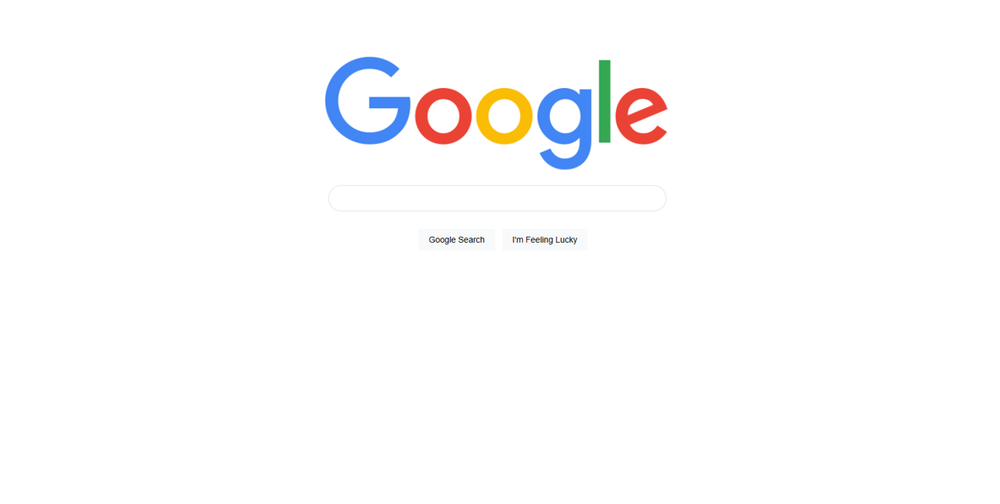

# Google Homepage Clone

A responsive clone of the Google homepage built to demonstrate fundamental web development skills.

## Preview

## Technologies Used
* HTML5 (Semantic Structure)
* CSS3 (Flexbox, Hover states, Styling)

## Features
* Centered layout using modern CSS Flexbox.
* Interactive hover and focus states mirroring the actual search engine UI.